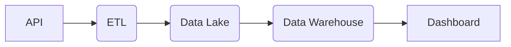

# Objetivo

Esse projeto tem como objetivo primario um reforço a minha aprendizagem com eng. dados, no caso a ideia foi criar um pipeline de dados de criptomoedas.
No caso além de um pipeline de data-driven e valido reforçar a utilização do git para subir projetos.

## Arquitetura

## Stack

<h4> Python
<h4> Pandas
<h4> Parquet
<h4> DuckDB
<h4> Power BI (a pensar)

## lib
Pandas == 3.0.1 
pip-tools == 7.5.3 
requests == 2.32.5 
duckdb==1.5.0 
pyarrow==23.0.1

## linux
Criação de ambiente 
sudo apt update, sudo apt install python3-venv, python3 -m venv .venv, source .venv/bin/activate 
pip-compile requirements.in